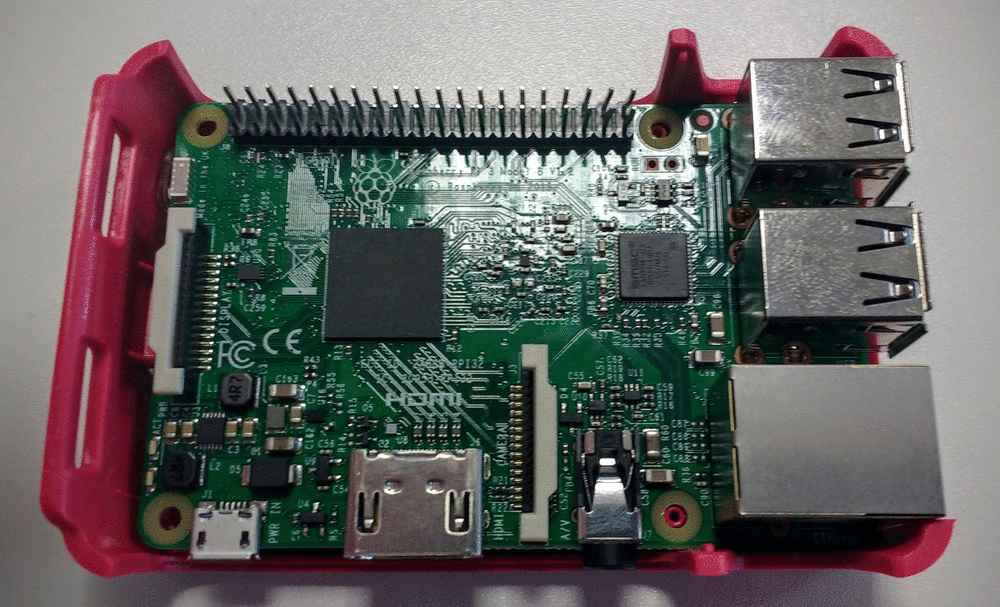

# The Raspberry Pi case

The official Raspberry Pi case is perfect for protecting your Raspberry Pi, while still giving you easy access to all the ports and GPIO pins.

You can purchase the case from [element14](https://www.element14.com/community/docs/DOC-76996/l/raspberry-pi-official-enclosure-from-the-raspberry-pi-foundation?ICID=rpimain-picase-ban) and [RS Components](http://uk.rs-online.com/web/p/development-board-enclosures/8787594/).

The case is very easy to assemble, and there's even enough space in there to fit some HATs like the SenseHAT.

