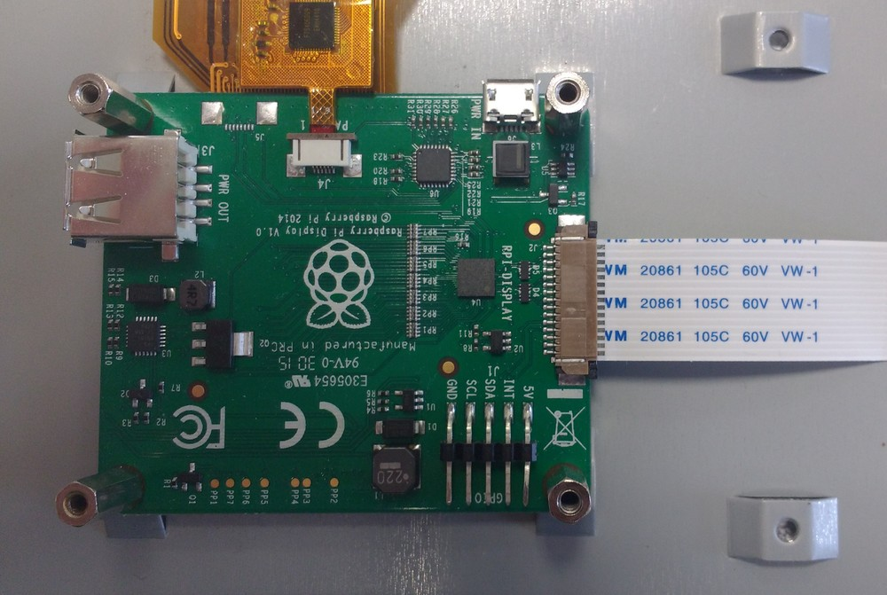
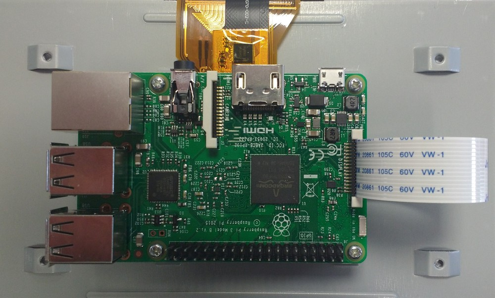
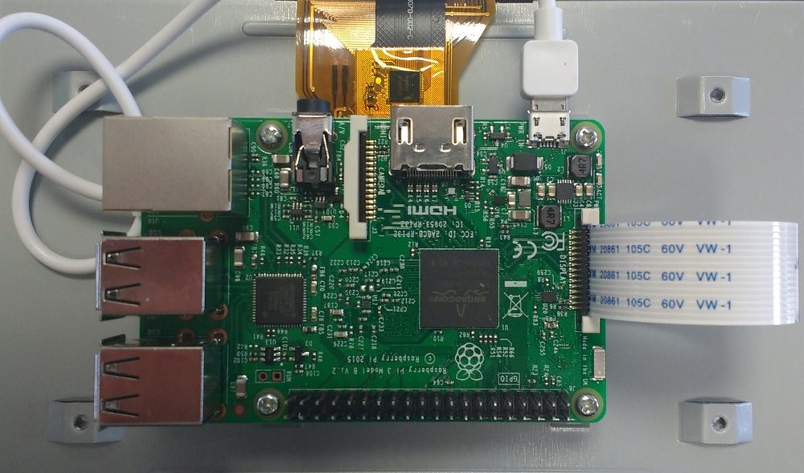
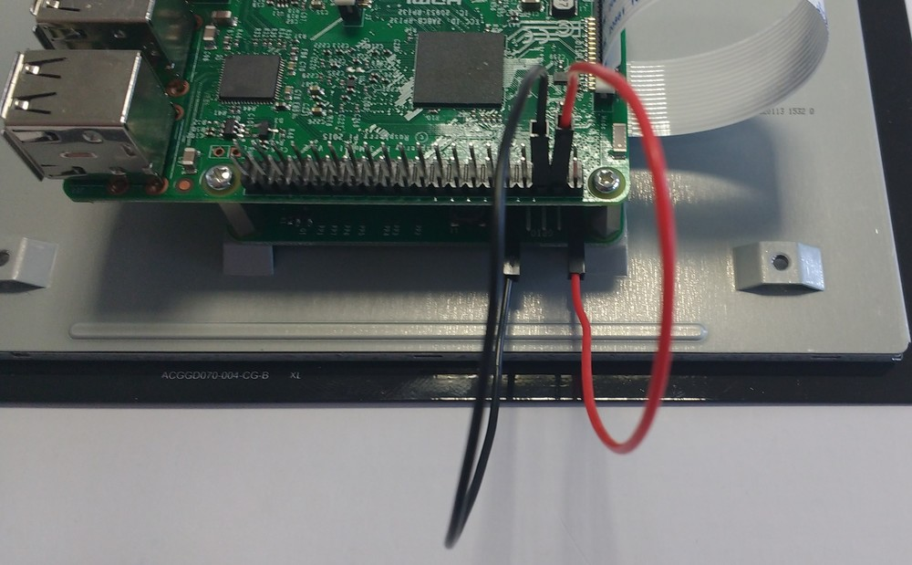

# The Raspberry Pi Display

The Raspberry Pi Display is a 7-inch touch screen display, designed to work with the Raspberry Pi.
You can purchase a Raspberry Pi from [CPC](http://cpc.farnell.com/raspberry-pi/raspberrypi-display/raspberry-pi-touchscreen-display/dp/SC13858) and [RS Components](http://uk.rs-online.com/web/p/graphics-display-development-kits/8997466/).

The display has the following features:
- Multi-touch capacitive touch screen — supports up to 10 finger touches
- 800 x 480 pixel resolution at 60 frames per second (fps)
- 24-bit RGB colour
- 70° viewing angle

If you have purchased a display, then attaching it to your Raspberry Pi is fairly easy.

1. First, connect the DSI ribbon cable to the board on the back of the display.

	

1. Then mount the Raspberry Pi with the provided machine screws and attache the DSI ribbon cable to the DSI port.

	
	
1. To power the display you can either plug in your microUSB power supply into the microUSB port on the display board, and then use a second USB-A to microUSB-B to power your Raspberry Pi from the display:

	
	
1. Or you can power the display from a 5V pin on the Raspberry Pi, using the included jumper leads.

	
	
You can use the touch screen interface of the display to operate your Raspberry Pi, if you like, although the desktop is not designed to be used with touch devices. However, with the power of Kivy, you can make your own applications in [Python that utilise the multi-touch features of the display](https://www.youtube.com/watch?v=Eah3Zq18OyM).
