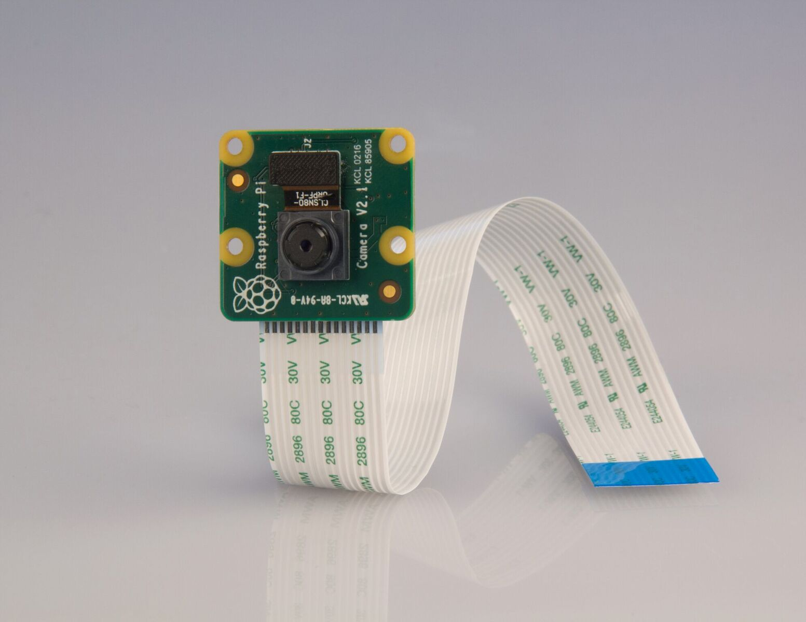
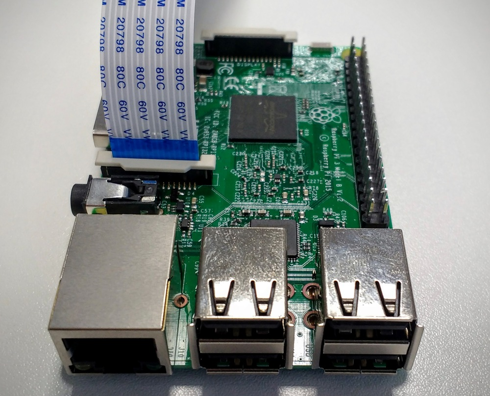
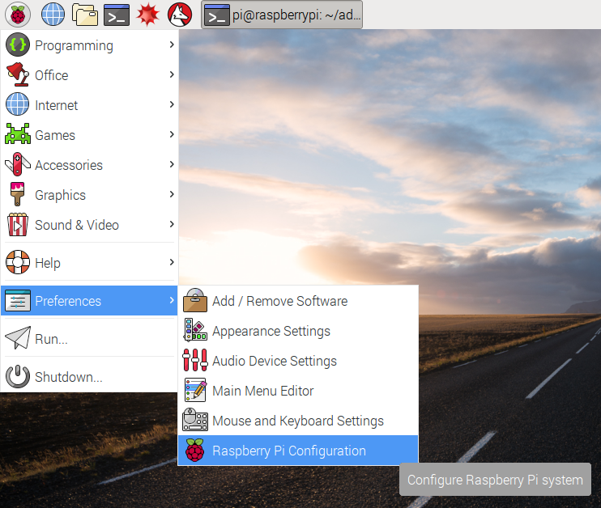
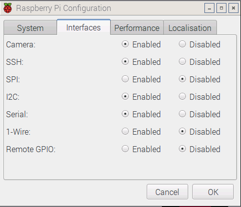

# The Pi Camera

The new 8-megapixel Pi Camera comes in two varieties. A standard visible light camera and an infrared sensitive camera known as the Pi NoIR.



You can purchase both cameras from either [RS Components](http://uk.rs-online.com/web/c/computing-peripherals/embedded-systems/video-modules/?searchTerm=p-semis-l1-p5-0516_uk&searchType=Offers&h=s&sra=oss&redirect-relevancy-data=77633D4E4F4E4526) or [element 14](https://www.element14.com/community/community/raspberry-pi/raspberry-pi-accessories/raspberry-pi-camera-board)

The Pi Camera is capable of taking both still pictures, up to a resolution of 3280 x 2464 pixels, and of taking video up to 1080p at 30fps.

The camera board attaches to the Raspberry Pi using a CSI flat ribbon cable, which comes with the camera when purchased. It can then be attached to the CSI port on the Raspberry Pi, as shown below.



To use the Pi Camera, you will need to enable it in the configuration menu. Open this by clicking on **Menu** > **Preferences** > **Raspberry Pi Configuration**



Then click on the radio button to enable the camera.



You can then use the camera from the terminal to take photos and videos

``` bash
raspistill -o cam.jpg
```
and

``` bash
raspivid -o vid.h264
```

If you want greater control over the photos and videos you take though, you're better off using Python 3 to control the camera. You can find the [Getting Started with Picamera](https://www.raspberrypi.org/learning/getting-started-with-picamera/) resource in the education section of the website, or you could have a look through the [Picamera documentation](http://picamera.readthedocs.io/en/release-1.10/) for even more information.
