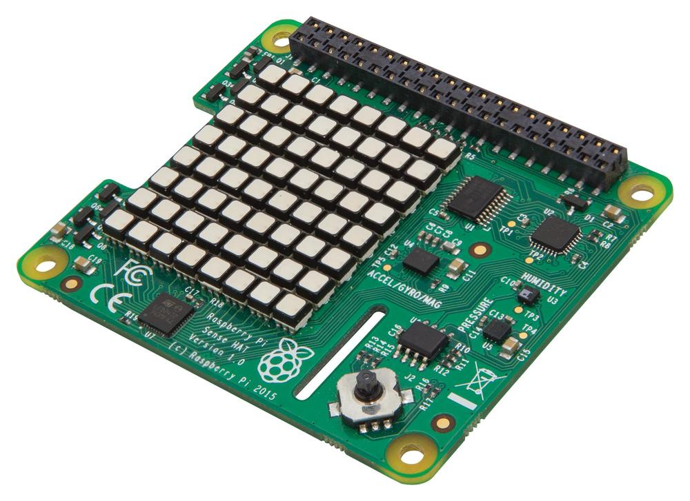

# The Sense HAT

The Sense HAT was designed and created for the [Astro Pi project](https://astro-pi.org/). You can purchase a Sense HAT from [RS Components](http://uk.rs-online.com/web/p/interface-development-kits/8949310/) and [CPC](https://cpc.farnell.com/raspberry-pi/raspberrypi-sensehat/add-on-board-sense-hat-for-raspberry/dp/SC13930?COM=main-search%20CMPNULL).

The Sense HAT is packed full of sensors, including a:

- Gyroscope, to measure the orientation of the Sense HAT
- Accelerometer, to measure the acceleration of the Sense HAT
- Magnetometer, to measure the Earth's magnetic field
- Temperature sensor, to measure the atmospheric temperature
- Barometric pressure sensor, to measure the atmospheric pressure
- Humidity sensor, to measure the percentage of the air's water saturation

There is also a small joystick on the Sense HAT, and a large 8×8 RGB LED matrix.

The Sense HAT is added to the Raspberry Pi using the rows of GPIO pins. Simply place the Sense HAT onto the Raspberry Pi, making sure the pins align.

If you have a Sense HAT then our [Getting started with the Sense  HAT](https://www.raspberrypi.org/learning/getting-started-with-the-sense-hat/) guide is the best place to start. There are also resources showing you how to make [a reaction timer game in Scratch](https://www.raspberrypi.org/learning/astronaut-reaction-times/), a [marble maze in Python](https://www.raspberrypi.org/learning/sense-hat-marble-maze/), and crazy [random sparkles](https://www.raspberrypi.org/learning/sense-hat-random-sparkles/), and many more.
